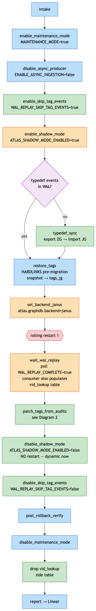
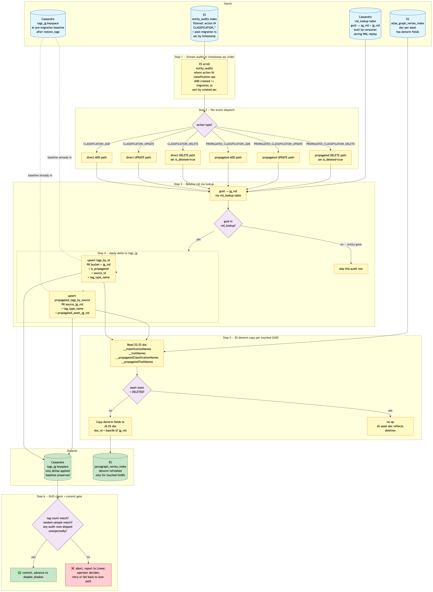
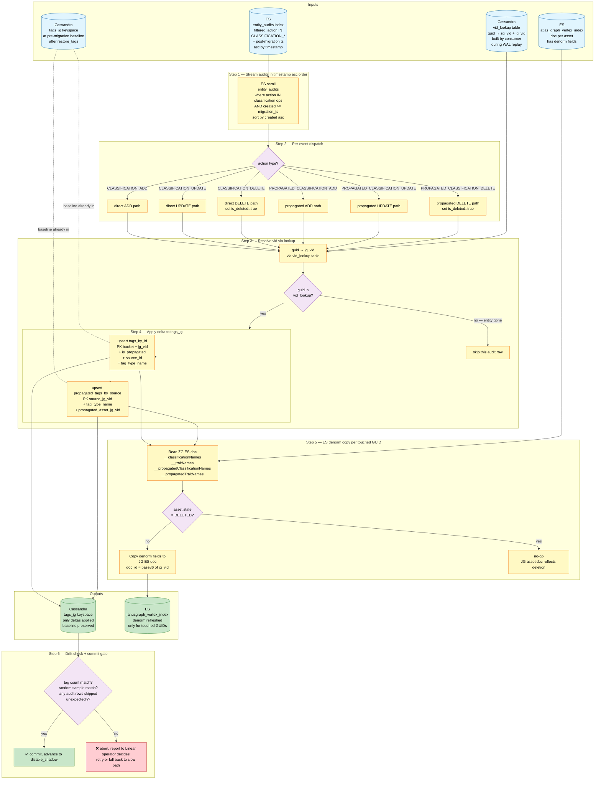
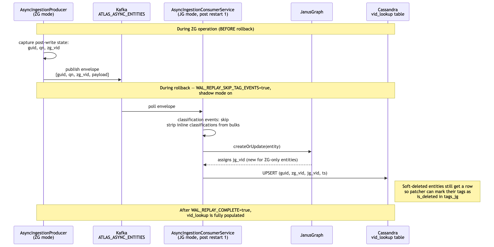
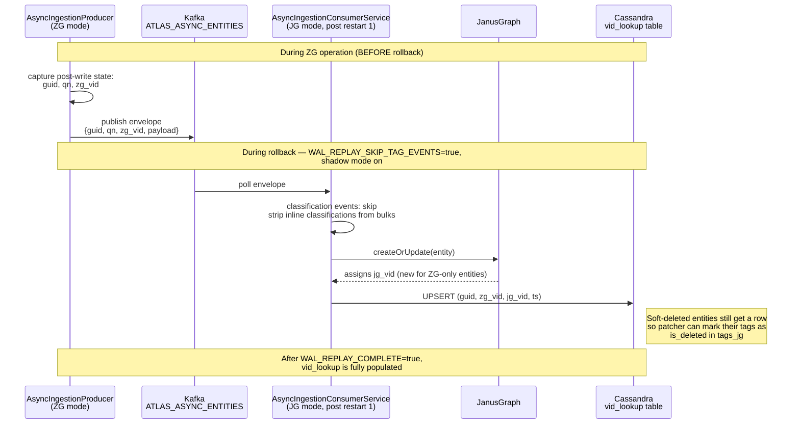

# ZeroGraph Rollback — Tag Patcher Plan

> **Status:** Design v2 approved 2026-04-27. Ready to implement (no code yet — plan only).
> **Owner:** Sriram Aravamuthan
> **Related PRs:** atlas-metastore #6592 (rollback E2E base), mothership #621 (rollback agent)
> **Supersedes:** v1 (full-keyspace translation). v2 uses delta-from-audits.

## Goal

Eliminate the tag-propagation recompute that happens during ZG → JG rollback. Today's flow restores the `tags` keyspace from a pre-migration Cassandra snapshot, then relies on WAL replay to re-apply every classification mutation — each of which triggers a full propagation walk through lineage. For tenants with non-trivial tag use this is the dominant cost in the rollback wall-clock budget.

**v2 plan:** keep `restore_tags` (pre-migration baseline), skip classification events in WAL replay, then apply only the **deltas** that happened during ZG operation by reading them from `entity_audits` (which has direct AND propagated classification events per receiver). Use a Cassandra-resident vid lookup that the WAL consumer populates as a side-effect of replay.

This avoids:
- Full `tags_zg` keyspace scan (v1 cost)
- Propagation re-derivation (today's cost — Atlas walks lineage for each classification mutation)
- Re-running classification add/delete mutations through the runtime (which triggers propagation)

## Context anchors (read these before changing anything)

- **memory/zerograph-recovery-strategy.md** — three recovery paths, the vertex-ID problem, and the original "tags revert" analysis. Notes about Solution 1/4 are superseded by this plan.
- **memory/feedback_wal_producer_always_on_in_zg.md** — `ENABLE_ASYNC_INGESTION` semantics. WAL producer stays ON during normal ZG operation; rollback flips it OFF.
- **memory/sgp-es-indices.md** — ES vertex indices: `atlas_graph_vertex_index` (ZG), `janusgraph_vertex_index` (JG).
- **memory/janusgraph-encoding.md** — JG ES doc IDs are base-36 of the numeric vertex_id; ZG uses raw numeric.
- **atlanhq/mothership PR #621** — current rollback agent (`agents/zerograph_deployer/rollback/`).
- **atlas-metastore PR #6592** — base for these changes (`ms-600-rollback-e2e`).

## Key facts that drove the design

1. **Tags live ONLY in the `tags` Cassandra keyspace + ES denorm.** Nothing in the graph backend (JG or ZG) holds classification data. Verified in `repository/src/main/java/org/apache/atlas/repository/store/graph/v2/tags/TagDAOCassandraImpl.java`.
2. **Tags keyspace schemas are vertex-id-keyed:**
   - `tags_by_id`: PK `((bucket, id), is_propagated, source_id, tag_type_name)`. `id` and `source_id` are vertex IDs.
   - `propagated_tags_by_source`: PK `((source_id, tag_type_name), propagated_asset_id)`. Both `source_id` and `propagated_asset_id` are vertex IDs.
   - Tag deletes are **soft** (`is_deleted` column on `tags_by_id`) — physical row is preserved.
3. **ES denorm fields** on each entity vertex doc, written via `TagDeNormAttributesUtil.java`:
   - `__classificationNames` (pipe-delimited direct tags)
   - `__traitNames` (list of direct tag type names)
   - `__propagatedClassificationNames` (pipe-delimited propagated tags)
   - `__propagatedTraitNames` (list of propagated tag type names)
4. **Vertex IDs:**
   - Migrated entities: ZG vid = JG vid (legacy strategy preserved during migration). Lookup is identity, no rewrite needed.
   - Post-migration (ZG-only) entities: ZG vid = `UUID.randomUUID()`, different from any JG vid. Translation needed.
5. **`entity_audits` covers both direct and propagated classifications per receiver.** Verified in `EntityAuditListenerV2.java`:
   - Lines 234-238 (`onClassificationsAdded`): branches on `entity.getGuid().equals(classification.getEntityGuid())` → emits `CLASSIFICATION_ADD` if same (direct) or `PROPAGATED_CLASSIFICATION_ADD` if different (propagated).
   - Line 281-284 (`onClassificationPropagationsAdded`): emits `PROPAGATED_CLASSIFICATION_ADD` per receiver entity, one row per (entity, classification) pair.
   - `onClassificationsUpdated` and `onClassificationsDeleted` follow the same direct/propagated split with their own `_UPDATE` / `_DELETE` actions.
   - Audit listener has `if (skipForShadowMode()) return;` as the very first guard — when shadow is on (during rollback), audit log is frozen. So we read only the pre-rollback ZG-period events.
6. **`entity_audits` ES index structure** (per `ESBasedAuditRepository.java:396`):
   ```
   { entityId: <guid>, action: <action_enum>, detail: <classification JSON>,
     user: ..., eventKey: <entityId:timestamp>, entityQualifiedName: ...,
     typeName: ..., created: <epoch_ms>, timestamp: <epoch_ms>, headers: ... }
   ```
   Index name is `entity_audits` (configurable via `atlas.audit.elasticsearch.index`).
7. **WAL classification events** captured today (`EntityMutationService.java`) — **these are dropped during replay** (the patcher handles tags, not the WAL consumer):
   - Standalone: `ADD_CLASSIFICATIONS`, `UPDATE_CLASSIFICATIONS`, `DELETE_CLASSIFICATION`, `ADD_CLASSIFICATION_BULK`, `SET_CLASSIFICATIONS`.
   - Inline (within bulk entity ops): `BULK_CREATE_OR_UPDATE`, `UPDATE_BY_UNIQUE_ATTRIBUTE`, `RESTORE_BY_GUIDS` may carry `entity.classifications` — must be stripped before the bulk handler runs.
8. **ES is NOT source of truth for tag state.** History of ES/Cassandra drift complaints. The `entity_audits` ES index is treated as the audit log (append-only record of operations) — that's the only ES read in this design that matters for correctness. `atlas_graph_vertex_index` is read for ES denorm copy but the equivalent data is also in `tags_zg`; the ES doc copy is just an optimization.
9. **ES alias for vertex index** is a separate operational improvement (atlas points reads at an alias, alias swaps to a fresh index when needed). Out of scope for this plan; track separately.
10. **Typedef changes:** WAL coverage unconfirmed. Plan: if WAL doesn't cover typedef events, mothership does an explicit typedef export-import before running the WAL consumer. See "Typedef sync" section.

## Architecture

### Diagram 1 — Rollback orchestration (mothership-side)

New nodes are filled green; existing nodes that change behavior are amber; existing nodes unchanged are blue. Restart points are marked red. Decision branches are purple.

```mermaid
flowchart TD
    intake[intake] --> mm[enable_maintenance_mode<br/>MAINTENANCE_MODE=true]
    mm --> dap[disable_async_producer<br/>ENABLE_ASYNC_INGESTION=false]
    dap --> ste[enable_skip_tag_events<br/>WAL_REPLAY_SKIP_TAG_EVENTS=true]
    ste --> esm[enable_shadow_mode<br/>ATLAS_SHADOW_MODE_ENABLED=true]
    esm --> tsq{typedef events<br/>in WAL?}
    tsq -->|no| ts[typedef_sync<br/>export ZG → import JG]
    tsq -->|yes| restore
    ts --> restore
    restore[restore_tags<br/>HARDLINKS pre-migration<br/>snapshot → tags_jg]
    restore --> backend[set_backend_janus<br/>atlas.graphdb.backend=janus]
    backend --> r1{{rolling restart 1}}
    r1 --> wait[wait_wal_replay<br/>poll WAL_REPLAY_COMPLETE=true<br/>consumer also populates<br/>vid_lookup table]
    wait --> patch[patch_tags_from_audits<br/>see Diagram 2]
    patch --> exit[disable_shadow_mode<br/>ATLAS_SHADOW_MODE_ENABLED=false<br/>NO restart — dynamic now]
    exit --> dste[disable_skip_tag_events<br/>WAL_REPLAY_SKIP_TAG_EVENTS=false]
    dste --> verify[post_rollback_verify]
    verify --> mmoff[disable_maintenance_mode]
    mmoff --> cleanup[drop vid_lookup<br/>side table]
    cleanup --> report[report → Linear]

    classDef new fill:#c8e6c9,stroke:#2e7d32,color:#000
    classDef changed fill:#ffe0b2,stroke:#e65100,color:#000
    classDef existing fill:#bbdefb,stroke:#1565c0,color:#000
    classDef restart fill:#ffcdd2,stroke:#b71c1c,color:#000
    classDef decision fill:#f3e5f5,stroke:#6a1b9a,color:#000

    class intake,mm,dap,verify,mmoff,report,restore existing
    class ste,ts,patch,exit,dste,cleanup new
    class esm,backend,wait changed
    class r1 restart
    class tsq decision
```





**Key changes vs today's flow:**
- One rolling restart instead of two (`disable_shadow_mode` is a dynamic config flip — see PR #6592).
- New nodes set/unset `WAL_REPLAY_SKIP_TAG_EVENTS` (consumer-side filter).
- `restore_tags` stays — it gives us the pre-migration baseline of `tags_jg`.
- `wait_wal_replay` has an additional side-effect: the consumer writes a `vid_lookup` row for every entity it creates in JG (the producer also includes ZG vid in the envelope).
- `patch_tags_from_audits` is the new patcher, fueled by `entity_audits` (post-migration deltas) + `vid_lookup`.
- Cleanup drops the lookup side table after rollback.

### Diagram 2 — Patcher internals (delta-from-audits)





**Reading guide:**
- 🔵 inputs: `entity_audits` ES (the delta source), `vid_lookup` Cassandra side table (built by consumer), `atlas_graph_vertex_index` ES (denorm copy source), pre-migration `tags_jg` baseline (from `restore_tags`).
- 🟡 patcher steps: stream audits in timestamp asc, dispatch by action, resolve vid, apply, copy denorm.
- 🟣 decision points: action type, vid-presence (skip soft-deleted-entity rows where appropriate), asset-state for denorm.
- 🟢 outputs: `tags_jg` keyspace with deltas applied on top of restored baseline; `janusgraph_vertex_index` denorm refreshed only for touched GUIDs.
- 🔴 abort path on drift: rollback-of-rollback decision is on the operator, with the slow path (`WAL_REPLAY_SKIP_TAG_EVENTS=false`, restart consumer, replay all classification events through Atlas runtime) as the fallback.

### Diagram 3 — Vid lookup population during WAL replay

How `vid_lookup` gets built (no separate scan pass — it's a consumer side-effect).





The producer change is small: add `zg_vid` to the envelope alongside the existing `guid` + `qn`. The consumer change: after `entitiesStore.createOrUpdate(...)` returns with the new JG entity, write a row into `atlas_graph.vid_lookup`.

### Patcher pseudocode (with the v2 audit-driven flow)

```python
# 0. Inputs
migration_ts   = read_from_tenant_metadata()  # when ZG mode started for this tenant
es_audits      = ESClient(index='entity_audits')
es_zg          = ESClient(index='atlas_graph_vertex_index')
es_jg          = ESClient(index='janusgraph_vertex_index')
cql            = CassandraSession()
TAG_OPS = {
    'CLASSIFICATION_ADD', 'CLASSIFICATION_UPDATE', 'CLASSIFICATION_DELETE',
    'PROPAGATED_CLASSIFICATION_ADD', 'PROPAGATED_CLASSIFICATION_UPDATE', 'PROPAGATED_CLASSIFICATION_DELETE',
}

# 1. Stream classification audits in timestamp ascending order
query = {
    "query": {
        "bool": {
            "must": [
                {"terms": {"action": list(TAG_OPS)}},
                {"range": {"created": {"gte": migration_ts}}}
            ]
        }
    },
    "sort": [{"created": "asc"}]
}

touched_guids = set()

for event in es_audits.scroll(query):
    guid    = event['entityId']
    action  = event['action']
    detail  = json.loads(event['detail'])
    tag     = detail.get('typeName')
    source_guid_for_propagation = detail.get('entityGuid')   # only present for propagated events
    ts      = event['created']

    # 2. Resolve via vid_lookup
    row = cql.execute(
        "SELECT zg_vid, jg_vid FROM atlas_graph.vid_lookup WHERE guid = %s",
        (guid,)
    ).one()
    if row is None:
        log.warning(f"audit row references guid {guid} but vid_lookup has no entry — skipping")
        continue
    jg_vid = row.jg_vid

    # For propagated events, also resolve source_guid
    source_jg_vid = None
    if action.startswith('PROPAGATED_'):
        src_row = cql.execute(
            "SELECT jg_vid FROM atlas_graph.vid_lookup WHERE guid = %s",
            (source_guid_for_propagation,)
        ).one()
        if src_row is None:
            log.warning(f"propagation source guid {source_guid_for_propagation} not in vid_lookup — skipping")
            continue
        source_jg_vid = src_row.jg_vid

    # 3. Apply delta to tags_jg
    bucket = compute_bucket(jg_vid)
    is_propagated = action.startswith('PROPAGATED_')
    is_delete     = action.endswith('_DELETE')
    src_for_eff   = source_jg_vid if is_propagated else jg_vid

    if action.endswith('_ADD') or action.endswith('_UPDATE'):
        cql.execute("""
          INSERT INTO tags_jg.tags_by_id
            (bucket, id, is_propagated, source_id, tag_type_name,
             tag_meta_json, asset_metadata, updated_at, is_deleted)
          VALUES (%s, %s, %s, %s, %s, %s, %s, %s, false)
        """, (bucket, jg_vid, is_propagated, src_for_eff, tag,
              json.dumps(detail), event.get('asset_metadata', '{}'), ts))

        if is_propagated:
            cql.execute("""
              INSERT INTO tags_jg.propagated_tags_by_source
                (source_id, tag_type_name, propagated_asset_id, asset_metadata, updated_at)
              VALUES (%s, %s, %s, %s, %s)
            """, (source_jg_vid, tag, jg_vid, event.get('asset_metadata', '{}'), ts))

    elif is_delete:
        # Soft delete: mark is_deleted=true, do not physically remove
        cql.execute("""
          UPDATE tags_jg.tags_by_id
          SET is_deleted = true, updated_at = %s
          WHERE bucket = %s AND id = %s AND is_propagated = %s
            AND source_id = %s AND tag_type_name = %s
        """, (ts, bucket, jg_vid, is_propagated, src_for_eff, tag))

        if is_propagated:
            cql.execute("""
              DELETE FROM tags_jg.propagated_tags_by_source
              WHERE source_id = %s AND tag_type_name = %s AND propagated_asset_id = %s
            """, (source_jg_vid, tag, jg_vid))

    touched_guids.add(guid)

# 4. ES denorm copy for touched GUIDs
for guid in touched_guids:
    row = cql.execute("SELECT zg_vid, jg_vid FROM atlas_graph.vid_lookup WHERE guid = %s", (guid,)).one()
    if not row:
        continue

    zg_doc = es_zg.get(id=row.zg_vid)
    if zg_doc is None:
        log.warning(f"ZG doc missing for guid {guid} — skipping denorm copy")
        continue

    # If the asset is deleted (its own __state field on the entity), no-op the denorm copy.
    # The JG asset doc already reflects the deletion via WAL replay's DELETE_BY_GUID.
    if zg_doc.get('__state') == 'DELETED':
        continue

    jg_doc_id = base36_encode(int(row.jg_vid))
    denorm_fields = {
        '__classificationNames':         zg_doc.get('__classificationNames', ''),
        '__traitNames':                  zg_doc.get('__traitNames', []),
        '__propagatedClassificationNames': zg_doc.get('__propagatedClassificationNames', ''),
        '__propagatedTraitNames':        zg_doc.get('__propagatedTraitNames', []),
    }
    es_jg.update(id=jg_doc_id, doc=denorm_fields)

# 5. Drift check
zg_count_per_guid = es_zg.aggs(...)        # tag count per asset, ZG-side
jg_count_per_guid = cql.aggs(...)          # tag count per asset, post-patch
diff = compare(zg_count_per_guid, jg_count_per_guid)
if diff > tolerance:
    raise PatcherDrift("counts disagree", diff)

sample = random.sample(list(touched_guids), 20)
for guid in sample:
    assert tag_set(guid, source='zg') == tag_set(guid, source='jg_after_patch'), guid
```

## Implementation plan

### Phase 1 — atlas-metastore (target: new branch `ms-600-tag-patcher` off `ms-600-rollback-e2e`)

| # | Task | File(s) | Size | Test |
|---|---|---|---|---|
| 1.1 | Add `WAL_REPLAY_SKIP_TAG_EVENTS` dynamic config (default `false`) | `repository/.../service/config/ConfigKey.java` | XS | enum smoke test |
| 1.2 | Add `DynamicConfigStore.isWalReplaySkipTagEvents()` helper | `repository/.../service/config/DynamicConfigStore.java` | XS | helper test |
| 1.3 | Producer: include `zg_vertex_id` in WAL envelope (post-write capture, similar to GUID/QN already in #6592) | `repository/.../store/graph/v2/AsyncIngestionProducer.java`, `BulkRequestContext.java` | S (~30 LOC) | producer unit test |
| 1.4 | Consumer dispatch: when flag=true, skip standalone classification event types | `webapp/.../web/service/AsyncIngestionConsumerService.java` | S (~10 LOC) | unit test asserting these event types are not dispatched |
| 1.5 | Consumer dispatch: when flag=true, strip `entity.classifications` from bulk envelopes BEFORE invoking entity store | `webapp/.../web/service/AsyncIngestionConsumerService.java` | S (~30 LOC) | **CRITICAL test:** assert `getClassifications() == null` at entry to entity store calls when flag=true |
| 1.6 | Consumer: write `(guid, zg_vid, jg_vid, ts)` to `atlas_graph.vid_lookup` Cassandra side table after each entity create/update | `webapp/.../web/service/AsyncIngestionConsumerService.java` + new DAO | M (~80 LOC) | integration test against ephemeral Cassandra |
| 1.7 | DDL: create `atlas_graph.vid_lookup` table on Atlas startup if missing (idempotent CREATE TABLE IF NOT EXISTS) | new init step | XS | startup test |

### Phase 2 — mothership (target: new branch off `zerograph-rollback`)

| # | Task | File(s) | Size |
|---|---|---|---|
| 2.1 | New node `enable_skip_tag_events.py` — sets `WAL_REPLAY_SKIP_TAG_EVENTS=true` via `PUT /api/atlas/v2/configs/` | `agents/zerograph_deployer/rollback/nodes/` | XS |
| 2.2 | New node `typedef_sync.py` — exports typedefs from ZG, imports to JG (only if WAL doesn't carry typedef events; see "Typedef sync" below) | `agents/zerograph_deployer/rollback/nodes/` | M (~100 LOC) |
| 2.3 | New node `patch_tags_from_audits.py` — orchestrates the patcher (audit scroll → vid resolve → tags_jg apply → ES denorm copy → drift check) | `agents/zerograph_deployer/rollback/nodes/` | L (~300 LOC) |
| 2.4 | New node `disable_skip_tag_events.py` — sets `WAL_REPLAY_SKIP_TAG_EVENTS=false` after patcher commits | `agents/zerograph_deployer/rollback/nodes/` | XS |
| 2.5 | New node `cleanup_vid_lookup.py` — drops the `atlas_graph.vid_lookup` table after rollback completes | `agents/zerograph_deployer/rollback/nodes/` | XS |
| 2.6 | Wire new nodes into `agent.py` graph; keep `restore_tags`; insert `patch_tags_from_audits` between `wait_wal_replay` and `exit_shadow_mode` | `agents/zerograph_deployer/rollback/agent.py` | S |
| 2.7 | CLI dry-run support; per-phase Linear markers (🔵/✅/❌) following existing pattern | scripts/CLI | S |

### Phase 3 — validation

| # | Task |
|---|---|
| 3.1 | Synthetic tenant: create N entities in ZG, apply tags (direct + propagated via lineage), trigger rollback, verify post-rollback tag state matches via random sample |
| 3.2 | Drift check: assert `count(distinct guid)` and `count(rows with is_deleted=false)` match across pre-rollback ZG state ↔ post-rollback JG state |
| 3.3 | Performance: time the patcher on enpla91p19 (small dev tenant). Compare to a control run with the slow path (`WAL_REPLAY_SKIP_TAG_EVENTS=false`) |
| 3.4 | Recovery test: kill patcher mid-run, re-run, confirm idempotent convergence |
| 3.5 | Failover: simulate patcher catastrophic failure → fallback to slow path (toggle flag, restart consumer, replay) |
| 3.6 | Soft-delete coverage: create entity in ZG, tag it, delete entity in ZG, rollback. Verify tags_jg row marked `is_deleted=true`, JG ES doc reflects entity deletion. |
| 3.7 | Propagation coverage: tag asset A which propagates to B,C,D via lineage. Rollback. Verify tags_jg.propagated_tags_by_source has all three receivers, ES denorm refreshed for all four assets. |

## vid_lookup table design

```sql
CREATE TABLE IF NOT EXISTS atlas_graph.vid_lookup (
    guid text PRIMARY KEY,
    zg_vid text,
    jg_vid text,
    ts timestamp,
    -- entity_state captured at lookup-write time so the patcher can decide
    -- whether to no-op ES denorm for soft-deleted assets.
    entity_state text  -- ACTIVE | DELETED | PURGED
);
```

- Created on first WAL consumer start (idempotent CREATE).
- Written by the consumer for every entity create/update operation.
- Includes soft-deleted entities so the patcher can mark their tag rows as `is_deleted=true` (per Sriram's clarification).
- Dropped at rollback completion via `cleanup_vid_lookup`.

## Typedef sync (the "if WAL doesn't carry it" branch)

Before any code change, run this check:

```bash
# In atlas-metastore
grep -rn "publishAsyncIngestionEvent\|asyncIngestionProducer\.send\|asyncIngestionProducer\.publish" \
  --include="*.java" repository/src/main/java/org/apache/atlas/store \
  webapp/src/main/java/org/apache/atlas/web/rest/TypesREST.java
```

Look for whether typedef create/update operations call into the WAL producer. If yes, no extra work needed. If no, mothership runs:

```python
# Before WAL consumer starts (post restart 1):
typedefs_zg = atlas_zg.GET('/api/atlas/v2/types/typedefs')
atlas_jg.POST('/api/atlas/v2/types/typedefs', body=typedefs_zg)
```

Place this in `typedef_sync.py` (Phase 2 #2.2). Cost: one HTTP roundtrip + a possibly-heavy POST.

## Risks (carried forward and updated)

| ID | Risk | Likelihood | Mitigation |
|---|---|---|---|
| R1 | Strip in consumer (1.5) executes too late and classifications leak through | Medium | Hard requirement: strip lives at the very top of dispatch, BEFORE preprocessor invocation. Locked-down unit test. |
| R2 | `entity_audits` index has gaps for the post-migration window (e.g., audits dropped during high-load) | Low-medium | Pre-rollback verification: count of classification-action audits in window. If suspicious, fall back to the v1 keyspace-scan patcher (kept as a code path, gated on a flag). |
| R3 | `vid_lookup` row missing for a guid that has audit rows | Low | Patcher logs and skips the row; drift check catches it. Operator decision: re-run consumer (idempotent) or fall back to slow path. |
| R4 | Typedef out of sync between ZG and JG | Medium | Explicit `typedef_sync` node always runs. |
| R5 | Patcher dies mid-run | Low (impact medium) | Idempotent at every layer. Re-run converges. Last-resort: enable slow path. |
| R6 | ES denorm copy reads stale ZG ES doc (ES not synced with Cassandra at the moment of read) | Low | The patcher's denorm copy is best-effort optimization. Authoritative source is the patched `tags_jg` keyspace; Atlas's reads of denorm fall through to the keyspace if denorm is wrong. Worst case: a search ranking hiccup until next reindex. |
| R7 | ES alias change (separate work) collides with this work | Low | Explicitly out of scope. Coordinate via Linear ticket. |
| R8 | `entity_audits` is on ES — can't be source of truth in the strict sense | Medium | The audit log is treated as an operational record, not a graph-state derivation. If audits are missing operations, drift check catches it. The keyspace-scan patcher (v1 fallback) doesn't depend on audits. |

## Open questions to close before implementation

| Q | Owner | Resolution required by |
|---|---|---|
| Does WAL cover typedef events? | Implementer (5-min code dive) | Before Phase 2 #2.2 |
| Migration timestamp source — where is the migration completion timestamp stored per tenant, so the patcher knows the audit-filter lower bound? | Sriram | Before Phase 2 #2.3 |
| Do we want a `--dry-run` mode that runs the patcher's filter + resolve steps but doesn't write to `tags_jg` or ES? | Sriram | Before Phase 2 #2.3 (nice-to-have) |
| Does the bucket function for `tags_by_id` (`compute_bucket(jg_vid)`) need to mirror Atlas's runtime bucketing exactly? | Implementer (check `TagDAOCassandraImpl.calculateBucket`) | Before Phase 2 #2.3 |

## What's already done (background — don't redo)

- PR #6592 has shadow mode dynamic (`ATLAS_SHADOW_MODE_ENABLED` in `ConfigKey`, `DynamicConfigStore.isShadowModeEnabled()`, 11 call sites updated). This work depends on that being merged or stays on the same branch.
- PR #6592 has `WAL_REPLAY_COMPLETE` dynamic config + 30s drain signaler in `AsyncIngestionConsumerService`.
- PR #6592 has consumer's `isImportInProgress` bypass across 11 preprocessors.
- mothership #621 has the rollback agent skeleton, kubectl helpers, Linear integration, atlas-config client.

## How to start (next session)

1. Check this branch and PR are still in shape:
   ```bash
   cd /Users/sriram.aravamuthan/repositories/atlas-metastore
   git fetch origin
   git checkout ms-600-rollback-e2e
   git log --oneline -10
   gh pr view 6592 --repo atlanhq/atlas-metastore --json baseRefName,mergeable
   ```
2. Close open questions Q1 (typedef WAL coverage) and Q2 (migration ts source) before kickoff.
3. Create branch `ms-600-tag-patcher` off `ms-600-rollback-e2e`. Implement Phase 1 there.
4. Implement Phase 2 in mothership (`atlanhq/mothership`, branch off `zerograph-rollback`).
5. Run Phase 3 validation on `enpla91p19` (dev tenant — known-good rig from prior rollback E2E).

## File locations summary

**atlas-metastore (this repo):**
- `repository/src/main/java/org/apache/atlas/service/config/ConfigKey.java` — add `WAL_REPLAY_SKIP_TAG_EVENTS`
- `repository/src/main/java/org/apache/atlas/service/config/DynamicConfigStore.java` — add `isWalReplaySkipTagEvents()`
- `repository/src/main/java/org/apache/atlas/repository/store/graph/v2/AsyncIngestionProducer.java` — add `zg_vertex_id` to envelope
- `repository/src/main/java/org/apache/atlas/repository/store/graph/v2/BulkRequestContext.java` — capture `zg_vertex_id` post-write
- `webapp/src/main/java/org/apache/atlas/web/service/AsyncIngestionConsumerService.java` — strip + skip + write to vid_lookup
- new DAO for `vid_lookup` table operations
- `webapp/src/test/java/org/apache/atlas/web/service/AsyncIngestionConsumerServiceTest.java` — strip unit test + lookup write test

**mothership (`atlanhq/mothership`):**
- `agents/zerograph_deployer/rollback/nodes/enable_skip_tag_events.py` — new
- `agents/zerograph_deployer/rollback/nodes/typedef_sync.py` — new (conditional)
- `agents/zerograph_deployer/rollback/nodes/patch_tags_from_audits.py` — new (the patcher)
- `agents/zerograph_deployer/rollback/nodes/disable_skip_tag_events.py` — new
- `agents/zerograph_deployer/rollback/nodes/cleanup_vid_lookup.py` — new
- `agents/zerograph_deployer/rollback/agent.py` — wire new nodes; keep `restore_tags`

## Estimate

- atlas-metastore: 2 days incl. tests (added the producer envelope + vid_lookup DAO vs v1)
- mothership: 3-4 days
- Phase 3 validation: 1 day
- Total: ~1 week

## Out of scope (track separately)

- ES alias for vertex-index reads (operational improvement; not on this critical path)
- Single-ES-index unification (`atlas_graph_*` for both modes)
- WAL replay parallelism — investigated GUID partitioning + two-pass + bulk splitting. Found that without bulk splitting, partition-by-GUID has correctness gotchas for entities that span multiple bulks (re-crawl scenarios). Bulk splitting introduces FK-style retry complexity that violates the simplicity bar. Decision: defer parallel replay until Cohort 2+ scale forces the issue, at which point compaction-then-replay (drain WAL → side store → per-GUID net effect → parallel replay of final states) is preferred over partitioning. Track separately.
- Bulk-tenant rollback orchestration (single-tenant first)
