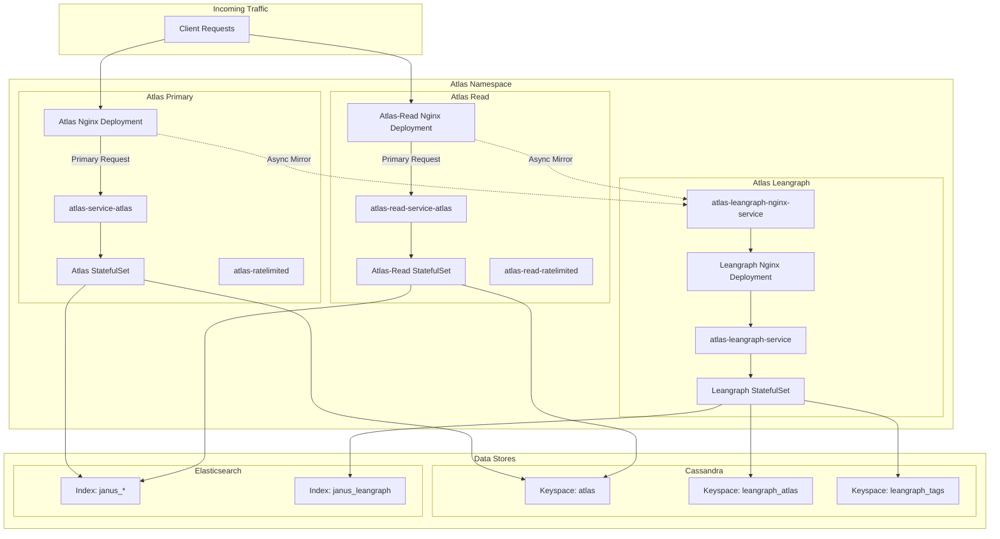
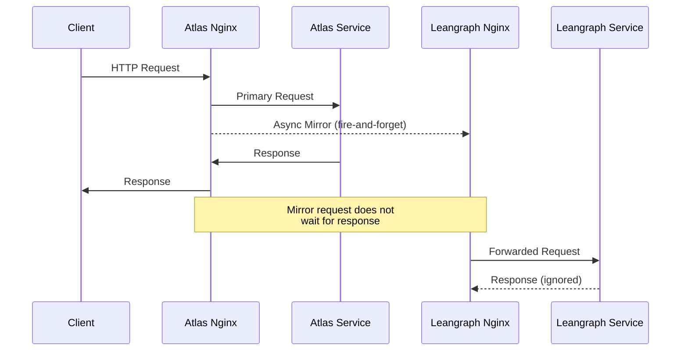
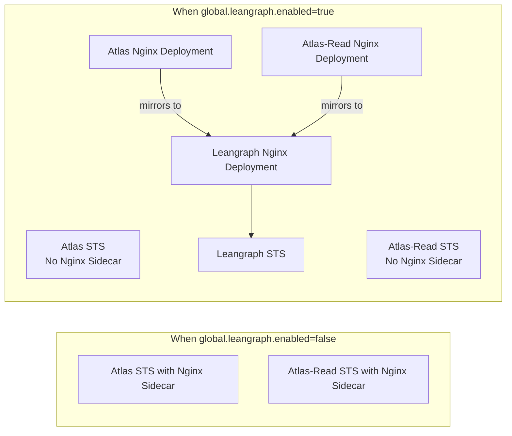
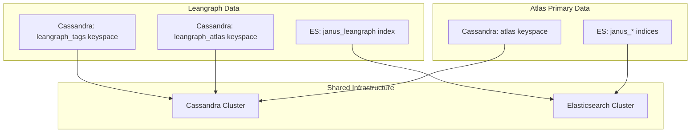

# Atlas Leangraph Helm Chart

## Overview

Atlas Leangraph is a lightweight graph database deployment that mirrors requests from the main Atlas and Atlas-Read services. It uses separate Cassandra keyspaces and Elasticsearch indices to maintain an independent data store while receiving the same write operations as the primary Atlas instance.

## Architecture

### High-Level Architecture



### Request Flow with Leangraph Enabled



### Component Deployment



## Configuration

### Global Flag

The entire Leangraph deployment is controlled by a single global flag:

```yaml
global:
  leangraph:
    enabled: false  # Set to true to enable Leangraph
    service: "atlas-leangraph-nginx-service.atlas.svc.cluster.local"
```

### Leangraph-Specific Configuration

| Property | Default Value | Description |
|----------|---------------|-------------|
| `atlas.leangraph.tag_table_name` | `leangraph_tags_by_id` | Cassandra table for tags |
| `atlas.leangraph.propagated_tag_table_name` | `leangraph_propagated_tags_by_source` | Cassandra table for propagated tags |
| `atlas.leangraph.new_keyspace` | `leangraph_tags` | New Cassandra keyspace for tags |
| `atlas.leangraph.cql_keyspace` | `leangraph_atlas` | Main Cassandra keyspace |
| `atlas.leangraph.index_name` | `janus_leangraph` | Elasticsearch index name |

### OTEL Configuration

Leangraph uses distinct OTEL service names for observability:

```yaml
OTEL_SERVICE_NAME: leangraph_atlas
OTEL_RESOURCE_ATTRIBUTES: service.name=leangraph_atlas,...
```

## Resources Created

When `global.leangraph.enabled=true`, the following resources are created:

### Atlas-Leangraph Chart

| Resource | Name | Description |
|----------|------|-------------|
| ConfigMap | `atlas-leangraph-config` | Atlas application properties |
| ConfigMap | `atlas-leangraph-nginx-config` | Nginx configuration |
| StatefulSet | `atlas-leangraph` | Main Atlas Leangraph pods |
| Deployment | `atlas-leangraph-nginx` | Nginx proxy deployment |
| Service | `atlas-leangraph-service` | Service for StatefulSet |
| Service | `atlas-leangraph-nginx-service` | Service for Nginx deployment |

### Atlas Chart Changes

| Resource | Change |
|----------|--------|
| StatefulSet | Nginx sidecar removed |
| Deployment | New `atlas-nginx` deployment created |
| Service | `atlas-ratelimited` points to nginx deployment |
| ConfigMap | Nginx config updated with mirror directive |

### Atlas-Read Chart Changes

| Resource | Change |
|----------|--------|
| StatefulSet | Nginx sidecar removed |
| Deployment | New `atlas-read-nginx` deployment created |
| Service | `atlas-read-ratelimited` points to nginx deployment |
| ConfigMap | Nginx config updated with mirror directive |

## Nginx Mirror Configuration

The nginx mirror directive is used for async request forwarding:

```nginx
location /api/meta/ {
    mirror @mirror_leangraph;
    mirror_request_body on;
    
    # Primary request handling
    proxy_pass $atlas_upstream;
    ...
}

location @mirror_leangraph {
    internal;
    proxy_pass http://atlas-leangraph-nginx-service.atlas.svc.cluster.local$request_uri;
    proxy_connect_timeout 1s;
    proxy_read_timeout 1s;
    # Fire-and-forget: response is ignored
}
```

## Data Isolation



## Backward Compatibility

This implementation is fully backward compatible:

| Scenario | Behavior |
|----------|----------|
| `global.leangraph.enabled=false` | No changes to existing behavior. Nginx runs as sidecar. No Leangraph resources created. |
| `global.leangraph.enabled=true` | Nginx moves to separate deployment. All requests mirrored to Leangraph. |

## Deployment

### Enable Leangraph

```yaml
# values.yaml override
global:
  leangraph:
    enabled: true
```

### Helm Install

```bash
helm upgrade --install atlas-leangraph ./helm/atlas-leangraph \
  --namespace atlas \
  --set global.leangraph.enabled=true
```

## Monitoring

### Key Metrics

- Leangraph nginx request rates and latencies
- Mirror request success/failure rates
- Cassandra keyspace metrics for `leangraph_atlas`
- Elasticsearch index metrics for `janus_leangraph`

### OTEL Traces

All Leangraph traces are tagged with:
- `service.name=leangraph_atlas`
- `k8s.namespace.name=atlas`

## Troubleshooting

### Mirror Requests Not Reaching Leangraph

1. Verify `global.leangraph.enabled=true` in all charts
2. Check nginx deployment logs for mirror errors
3. Verify `atlas-leangraph-nginx-service` is accessible

### Data Not Syncing

1. Check Leangraph StatefulSet pod logs
2. Verify Cassandra keyspace `leangraph_atlas` exists
3. Verify Elasticsearch index `janus_leangraph` exists

### Performance Issues

1. Mirror timeout is set to 1s - adjust if needed
2. Check Leangraph nginx deployment resource limits
3. Monitor Cassandra and Elasticsearch cluster health

